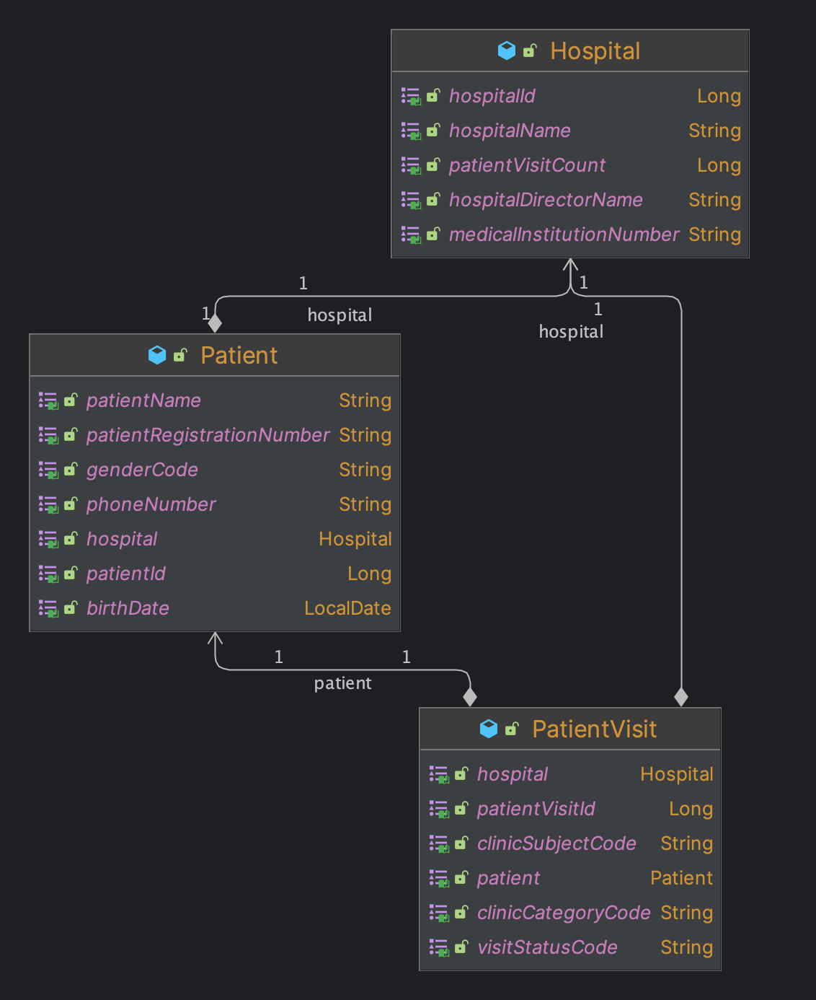

# ClinicSolution

## 개요
* 병원 및 환자의 정보를 관리하기 위한 api를 제공하는 애플리케이션.
* 기획서를 토대로 도메인을 개발자가 분석하여 API를 구현.
* 애플리케이션 테스트 시 프로젝트 문서화 진행.
* 요청사항의 번외로 다음을 구성
  * 병원 api 
  * 시스템 코드 도메인 규칙

## 2. Start Spring Boot
### test
* **/src/main/resource/static/docs** 내 api 문서가 생성
```
./gradlew clean build test    
```
### execute
* **Profile** `local` 실행
```
./gradlew clean build bootRun -Dspring.profiles.active=local
```

## business domain rule
* 병원(Hospital)
  * 정의
      병자 진찰 및 치료하는 데에 필요한 설비를 갖추어 놓은 장소
  * 속성
    * 병원ID : 병원의 유일함을 다루기 위한 고유 값, `숫자`
    * 병원명 : 병원의 이름을 의미,  `문자`
    * 요양기관번호 : 병원과 연관있는 요양기관의 번호, `문자`
    * 병원장명 : 병원장의 정보중 이름을 저장하는 속성, `문자`
    * 병원 방문자 수 : 병원에 방문한 환자의 수를 나타내는 속성, `숫자`
* 환자(Patient)
  * 정의
      * 병들거나 다쳐서 치료를 받아야 할 사람
  * 속성
    * 환자ID : 환자의 유일함을 다루기위한 고유 값, `숫자`
    * 병원ID : 환자와 연관이 있는 병원의 고유 값, `숫자`
    * 환자명 : 환자의 이름을 의미, `문자`
    * 환자등록번호
      * 일반인이 환자로 접수되며 생성되는 번호, `문자`
      * 병원 별로 중복되지 않은 값 저장.
    * 성별코드 : 시스템 내에서 관리되는 환자의 성별 `시스템 코드`
    * 생년월일 : 환자의 생일을 의미, `숫자`
    * 휴대전화번호 : 환자의 휴대전화번호 정보, `숫자`
* 환자방문(PatientVisit)
  * 정의
    * 환자가 병원에 방문하여 진행되는 진료 상태를 확인하기 위한 정보
  * 속성
    * 환자방문ID : 환자방문에 대한 유일함을 다루기위한 고유 값, `숫자`
    * 병원ID : 환자방문과 연관된 병원의 고유 값, `숫자`
    * 환자ID : 환자방문과 연관된 환자의 고유 값, `숫자`
    * 접수일시 : 환자방문 정보의 생성일 `날짜 및 시간`
    * 방문상태코드 : 시스템 내 관리되는 방문 상태의 코드 `시스템 코드`
    * 진료유형코드 : 시스템 내 관리되는 진료유형의 코드 `시스템 코드`
    * 진료과목코드 : 시스템 내 관리되는 진료과목의 코드 `시스템 코드`
* 시스템 코드 가이드
  * 개요
    * 본 솔루션 내 사용되는 시스템 코드는 데이터베이스로 관리됩니다.
    * 시스템 코드는 다음과 같은 도메인으로 관리됩니다.
      * 시스템 그룹코드 : 동일 유형의 코드를 그룹으로 관리하기 위한 코드, 본 문서의 성별, 방문상태, 진료과목, 진료유형에 해당됩니다.
      * 시스템 코드 : 특정 유형내 속한 코드 값이며 시스템 그룹코드가 다르더라도 유일한 값을 가집니다.
  * 성별
    * `M` : Man(남자)를 표현하는 코드, 남
    * `F` : Female(여자)를 표현하는 코드, 여
    * `U`
      * 모름(Unclassified)을 표현하는 코드,
      * 환자의 생물학적 성별이 확인되지 않은 경우 표현한다.
  * 방문상태
    * `1` : 환자가 병원에 방문 중인 상태를 표현하는 코드
    * `2` : 환자의 진료가 종료 표현하는 코드
    * `3` : 취소
  * 진료과목
    * `01` : 병원 진료과 중 내과를 표현하는 코드
    * `02` : 병원 진료과 중 안과를 표현하는 코드
  * 진료유형
    * `D` : 진료유형 중 약처방을 표현하는 코드
    * `T` : 진료유형 중 검사를 표현하는 코드

## business domain diagram


## project structure
```
└── docs : 문서화 관련 디렉토리
 │  └──── asciidoc : asciidoc 파일관련 디렉토리
 └── http : api test를 위한 http client 디렉토리
 └── main  
 │  └──── java  
 │  │  └──── me  
 │  │     └──── kbh  
 │  │        └──── clinicsolution 
 │  │           └──── common : 공통 코드 관련 
 │  │           │  └──── code : 베이스 코드 및 시스템 코드
 │  │           │  └──── configuration : 프로젝트 
 │  │           │  └──── dto : 베이스 dto
 │  │           │  └──── entity : 베이스 entity
 │  │           │  └──── exception : 베이스 exception
 │  │           └──── domain 
 │  │              └──── hospital : 병원 관련 도메인 및 api 제공
 │  │              └──── patient : 환자 관련 도메인 및 api 제공
 │  │              └──── patientvisit : 환자 방문(내원) 도메인 및 api 제공
 │  └──── resources : 프로젝트 관련 설정 yml 및 리소스 보관 패키지 
 │     └──── static  
 │        └──── docs : 프로젝트 테스트 이후 생성되는 rest doc html 파일이 생성되는 디렉토리
 └── test  
    └──── java  
       └──── me  
          └──── kbh  
             └──── clinicsolution  
                └──── common  
                │  └──── code  
                │     └──── system : (번외) 시스템 코드 도메인 테스트
                └──── configuration : 테스트 관련 configuration 
                └──── doc : 테스트 문서화 관련 클래스 
                └──── domain : 
                   └──── hospital : 병원 api 테스트
                   └──── patient : 환자 api 테스트
                   └──── patientvisit : 환자 방문(내원) api 테스트
```